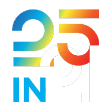

# Incorporating Accessibility in the Design Process

Statewide IT 2021 Workshop

Chris Basham



Notes:
Welcome everyone to this workshop. Today, we'll learn how to incorporate accessibility in the design process. First, let's start with some background and logistics.


## Chris Basham

csbasham@iu.edu

UX designer in Enterprise Student Systems.

*Accessibility. Front-end dev. Design systems.*

Notes:
I'm Chris Basham. I've worked at Indiana University since 2012, as a UX designer and front-end developer, working on various web software products. Over recent years, I've dived deeper into the topic of accessibility, and I want to share with you what I've learned regarding the intersection of these topics.


## Outline

| Time  | Duration | Description  |
| -----:| --------:| ------------ |
| 9:00  |      10m | Introduction |
| 9:10  |      50m | Part 1       |
| 10:00 |      10m | Break        |
| 10:10 |      50m | Part 2       |
| 11:00 |      10m | Break        |
| 11:10 |      50m | Part 3       |

Notes:
The workshop today is split into 3 major sections, over the course of 3 hours. The first will be a lecture, followed later by exercises. Each section will be divided by 10 minute breaks.


## Resources

https://github.com/basham/swit-workshop-a11y

Notes:
All resources for this workshop, including slides, slide notes, exercises, and links, are located on GitHub. Visit github.com/basham/swit-workshop-a11y. This link is posted in the Zoom chat.


## Zoom etiquette

- Submit questions in chat.
- Questions will be answered periodically.
- Mute when you're not talking.

Notes:
Because there's a lot to cover in this first section, I request you to submit any questions you have in the Zoom chat and keep yourself muted. I will then follow up with those questions periodically, between sections or after breaks.


## Annotate

Zoom → Toolbar → Annotate

<figure>


  <figcaption>Experiment with the various Zoom annotation tools.</figcaption>
</figure>

<footer>

See: [*Accessing and Using Annotation Tools in Zoom: Mac/Win*](https://help.lsit.ucsb.edu/hc/en-us/articles/360043613171-Accessing-and-Using-Annotation-Tools-in-Zoom-Mac-Win)

</footer>

Notes:
Throughout the workshop, we'll use Zoom's annotation tools. So, let's get familiar with it. Look for the toolbar, that hovers over the screen. Click on the "Annotate" button to bring up annotation tools.


## What comes to mind?

"Accessibility"

Notes:
Using Zoom's annotation tools, write down a word or phrase that comes to mind, when you hear the word "accessibility". Feel free to use stamps next to the response of someone else if you wish. Play around with a few settings, so you get a good sense for the tools.


# Problem

Accessibility is addressed too late in the development process.

Notes:
The problem we're addressing with this workshop today is that accessibility is often addressed too late in the development process.


## Consequences

- Devs are forced to make design decisions.
- Poor or unusable for those with assistive tech.
- Bugs, technical debt.

Notes:
There's a number of issues that result from this. When devs aren't given proper direction, they are forced to make decisions, the best they can. Because accessibility is not designed upfront, the experience for those using assistive technologies with the product is unknown. It could be fine, but likely it is poor or unusable in certain ways. Reworking is inevitable, resulting in bugs, ever growing technical debt, a lower quality product, high costs, and a slow process.


## Improve knowledge

- Learn how assistive tech is used.
- Study WCAG, ARIA, inclusive design.
- Review IU Knowledge Base articles.
- Talk, teach about accessibility.
- Join Slack channels.

Notes:
There are a lot of ways we address this problem. First, you can improve your knowledge. Research how assistive technology is used. Study the WCAG and ARIA documentation to better understand the vastness of the specs. Especially if you're a designer, investigate inclusive design practices. The IU Knowledge Base provides a lot of guidance, especially tailored for the work we do. You can talk and teach about accessibility, both within your team and among the teams you work with. There are a number of forums in which you talk about accessibility. The #topic-accessibility-web channel being of them on the iu-uits Slack workspace.


## Improve process

- Involve everyone.
- Discuss accessibility expectations early.
- Enrich design deliverables.
- Practice using keyboard, screen reader.
- Test accessibility before, after development.

Notes:
Second, you can improve your process. Everyone needs to be involved, including management, product owners, business analysts, quality assurance, developers, and designers. Teams should discuss accessibility expectations early in the process. Document those expectations alongside acceptance criteria, testing notes, and design deliverables. Include accessibility notes in wireframes. Put aside the mouse and test your software using a keyboard only. Practice using a screen reader, on both desktop and mobile device. Evaluate the accessibility of a design direction before development, and then test it again once implemented. Make accessibility reviews part of your team's process.


## Improve feedback

- Get early feedback
- Seek assistive tech users, experts, communities of practice, Digital&nbsp;Accessibility&nbsp;Office.
- Hire assistive tech users.

Notes:
Third, you should seek feedback from others. Get feedback from those who use assistive technologies. Seek accessibility experts from within your division or outside. Get involved in the various web development and design communities of practice. Reach out to the Digital Accessibility Office. And if you hire people who use assistive technologies, you'll have even a more direct means of feedback.


## Accessibility at IU

Notes:
Now, let's talk about some examples of accessibility initiatives at Indiana University.


## Digital Accessibility Office

- [IU.edu](https://www.iu.edu/)
- [IUPUI.edu](https://www.iupui.edu/)
- [IU Mobile](https://www.iu.edu/mobile-app/)

Notes:
The Digital Accessibility Office lead by Greg Hanek has been pushing to have accessibility addressed in the planning and design stages. They've recently worked on the IU site, IUPUI site, and the IU Mobile app. Involving them early has made a huge difference in the quality of those projects.


## Enterprise Systems

- [Accessibility Bootcamp](https://iu.mediaspace.kaltura.com/channel/Accessibility%2Bbootcamp/165180531) training
- [Accessibility Development Guidelines](https://uisapp2.iu.edu/confluence-prd/display/TAG/Accessibility+Development+Guidelines)
- Accessibility shares in dev community of practice
- Automated accessibility testing
- Cross-team accessibility committee
- Partnering with Digital Accessibility Office

Notes:
The Enterprise Systems division, which I am part of, has been doing a lot to improve our practices. In April, experts at Deque University conducted a multi-day bootcamp training for us. That content is now available for anyone at IU through Kaltura. Our developer leads have published accessibility guidelines for teams to follow. Developers will share various accessibility implementations and what they've learned, with the community of practice. Developers have incorporated automated accessibility testing tools, so we identify issues before features are manually tested. We have meetings to address accessibility issues across teams. And we've started to partner with the Digital Accessibility Office to evaluate some of our products.


## Workshop goals

- Identify design responsibilities.
- Learn how a screen reader works.
- Annotate wireframes.

Notes:
For the remainder of this workshop, we will focus on a few core things. We will learn how a screen reader works and communicates. Then we will conduct a number of exercises to help you better understand the experience of those using screen readers. Then we will explore how we can enrich design deliverables like wireframes to better articulate accessibility expectations.


## Out of scope

- Practice using a screen reader.
- Deep-dive into documentation.

Notes:
Given time constraints, we won't devote time during this workshop to practice using a screen reader. Also, we won't dive into the details of accessibility documentation. Those are good things for you to do at your own pace.


# Overview

Notes:
Now that we've established where we're going during this workshop, let's start by better understanding accessibility and how it fits into what we do.


## Human perfection is&nbsp;a&nbsp;myth

Notes:
There is no perfect human or human condition. Everyone has both abilities and disabilities. We are simply different along that spectrum.


## Disability is a mismatched interaction

Environment + Social context + Impairments

<footer>

See: [*Types of disabilities*](https://kb.iu.edu/d/atpo) (IU Knowledge Base)

</footer>

Notes:
We should think of disabilities as a mismatched interaction between a person and the world. This conflict is unique, depending on the environment, social context, or ways in which the person is impaired.


## Environment

Location. Weather. Time. Objects.

Notes:
The environment surely affects how we interact with the world. Being physical beings, we must be situated in a particular place and time. Maybe that's at home, at work, in the woods, or in a busy city center. Time of day, severity of the weather, and the stuff around you all affects what you can or want to do.


## Social context

Alone. Coworkers. Crowd. Friends. Family.

Notes:
Secondly, how you behave changes according to if you're alone or with others. And who those others are and how many of them will continue to affect your choices and behavior. An quiet setting with close friends is much different than a loud setting with strangers.


## Impairments

Permanent. Temporary. Situational.

Vision. Hearing. Mobility. Cognitive. Speech.

Noticeable. Invisible.

Notes:
Thirdly, you may be physically impaired in what you can do. Those impairments could be permanent, temporary, or situational. And those impairments can cover a range of physical and mental contexts. And those impairments may be noticeable by others or may be invisible to others.


|               | Permanent  | Temporary     | Situational  |
| ------------- | ---------- | ------------- | ------------ |
| **Vision**    | Blind      | Eye injury    | Bright room  |
| **Hearing**   | Deaf       | Ear infection | Noisy room   |
| **Mobility**  | Paralyzed  | Broken arm    | Carrying box |
| **Cognitive** | Dyslexia   | Concussion    | Distracted   |
| **Speech**    | Non-verbal | Laryngitis    | Heavy accent |

<footer>

See: [*Types of impairments*](https://kb.iu.edu/d/ayuj) (IU Knowledge Base)

</footer>

Notes:
Let's look at some examples. I could be born or become blind. Or maybe my sight could degrade because of an injury or cataracts. Then with a procedure, full sight could be restored. My sight could also be negatively affected by being in a bright room. If I'm driving, I could get distracted by a text message. My throat could be raspy because of a sickness. I travel to a place where my accent is not easily discerned. As these examples illustrate, we all experience impairments of some form.


## Mismatches cause exclusion

- Person + Person
- Person + Environment
- Person + Object

<footer>

See: [*Microsoft Design Inclusive Toolkits*](https://www.microsoft.com/design/inclusive/)

</footer>

Notes:
When we experience these mismatches, we inevitably experience some form of exclusion. We can't talk to a friend. We can't go where we want to go. We can't use a thing the way we want to.

As a simple example, when I was growing up, my family would often go to amusement parks. I loved going on roller coasters. But one time, after waiting in line for what seemed like hours, I was denied entry. I was too short. By a mere inch. I got mad and angry and threw fits. If the height requirement needed many inches, okay. I could handle that. But an inch was just close enough to be frustrating.

I was excluded from doing what I wanted to do. Granted, for this case, it was on purpose and for my personal safety. But many times, exclusion is not necessary. It becomes a form of cruelty. And not everyone has the power or energy or means to improve their situation.


## Tech can help or hinder

- Person + (Tech) + Person
- Person + (Tech) + Environment
- Person + (Tech) + Object

Notes:
Technology can be one means of augmenting these interactions, so that these mismatches can be overcome. We are currently using Zoom to communicate across distances. You use a can opener to open a can. You use a hat to shield you from the sun.

But not all technology is great. It can be misused, be abused, be nefarious, or simply be poorly designed. As those who work in technology, it is our obligation to create things that improve the lives of others. That could mean saving them time, energy, and frustration. But more importantly, it could mean empowering them to be included in society in ways previously restricted.


## Accessibility

"Can I use this?"

Notes:
Accessibility is inherently about inclusion. It asks the question, "Can I use this thing?" On the surface, the answer is binary. But as we've already learned, what one person is capable of is different than another or even themselves, depending on context and limitations.


## Usability

"How well can I use this?"

Notes:
Usability expands on capability and answers the question, "How well can I use this thing?" Does it demand a lot of time and causes frustration? Or does it easily disappear into the background, and the thing becomes a natural extension of myself?


## Assistive tech

- Mobility, hearing, cognitive aids
- Closed captioning
- Ramps, bars, wide doorways, elevators
- Hardware, software

Notes:
Technology that is purposefully designed to be highly accessible and usable is known as assistive technology. Depending on your needs, you may use various combinations of assistive tech. A crutch is a mobility aid. A sticky note is a cognitive aid. Closed captioning allows the deaf to experience movies and even those with hearing to confirm a phrase spoken softly. Ramps and wide doorways make it easy for those in wheelchairs and those with strollers to move it buildings.


## Assistive software

- Keyboard shortcuts
- Spell check, word prediction
- Voice control, dictation
- Contrast, color, motion, magnification settings
- Screen readers

Notes:
And of course, there is assistive software. Shortcuts allows you to make a change, without hunting through menus. Spell check and word prediction helps you to type (sometimes). You can adjust screen colors, if you are color blind and can't see red. You can zoom. And you can use a screen reader. That's where we'll spend most of our time during this workshop.


# Responsibility

80% of [WCAG 2.0](https://www.w3.org/TR/WCAG20/) success criteria are design&nbsp;decisions.

Notes:
80% of the decisions that go into making content accessible occur during the design process. This means that designers are responsible for the bulk of this work.


## WCAG

"Web Content Accessibility Guidelines"

Principles → Guidelines → Success Criteria

Notes:
WCAG stands for "Web Content Accessibility Guidelines". It is a document that defines dozens of success criteria, which helps you to test if a piece of content is accessible or not. These criteria are grouped into guidelines. Those guidelines are grouped into four major principles.


## WCAG Principles

1. Perceivable
2. Operable
3. Understandable
4. Robust

Notes:
There are four principles. The first three question if a piece of content can be seen, used, and understood by a user. The fourth questions if it can can be reliably interpreted by assistive technologies.


## Success criteria

- **A**: Usable
- **AA**: Good UX
- **AAA**: Ideal

Notes:
Success criteria are ranked in three levels. Each level builds up on the other. Level AA requires A conformance. Level AAA requires both A and AA conformance.

Some criteria can be automatically tested with scripts. Some criteria needs to be manually evaluated.

Level A covers basic usability. You're likely achieving this without too much explicit effort. Level AA is what you should aim for. Some criteria may not be as obvious. Level AAA is practically out of reach. It is an ideal to push you forward, but it isn't realistic. The document says:

"It is not recommended that Level AAA conformance be required as a general policy for entire sites because it is not possible to satisfy all Level AAA Success Criteria for some content."

See: https://www.w3.org/WAI/WCAG21/Understanding/conformance


## Criteria for designers

- [*Accessibility for designers: WCAG criteria*](https://kb.iu.edu/d/azyc#wcag) (IU&nbsp;Knowledge&nbsp;Base)
- [*Designing with Accessibility in Mind*](https://ux.iu.edu/writings/design-with-accessibility-part-1/) by&nbsp;Meagan&nbsp;Eller (IU UX Office)

Notes:
There are a couple of excellent places to start for designers at IU.

First, this IU Knowledge Base article succinctly lists these 80% of criteria as quick reference. And if you need some prompting, there are a number of questions that you can ask to start addressing these criteria.

Second, if you want more details and examples, Meagan Eller expanded on this topic in a three-part article posted on the IU User Experience Office blog.


# Design decisions

Notes:
Let's look at some examples of what we can do or what we should keep in mind when designing, to meet these criteria.


## Content order

- Visual UI is 2D (or 3D).
- HTML, reading, tab order is 1D.
- Mobile first approach.

Notes:
A visual user interface is often thought of as a two-dimensional thing. Or with the advent of virtual reality, three-dimensions. However, the foundation of this content is all 1-dimension. It is linear in nature. HTML, code, and text is written top to bottom. You read top to bottom. With a keyboard, you navigate top to bottom. It is important that before design in 2D, we design in 1D. That's the importance of the Mobile First practice. When you design for mobile, the limited viewport width is a constraint making you design linearly. It forces you to be intentional about the content order. Only then with a wider screen, the content can be enhanced in 2D with responsive design techniques.


## Name everything

- Especially if more than one of the same type.
- Helps users, team, devs, help guides.
- Pages. Headings. Landmarks. Links. Images. Tables. Form controls.

Notes:
Most every piece of content should have a name, especially if there is more than one of the same type of content in the page. This helps users distinguish content of the same type. This helps your team talk about certain aspects of the content. This helps your devs better organize code. This helps you write better help guides. Naming things is tough, but it is more difficult doing it retroactively.


## Audience

- Screen reader users<br>(`.sr-only`, `aria-label`, `alt`)
- Visual users<br>(`aria-hidden="true"`)
- Everyone

Notes:
You must decide the audience for any piece of content. Is it for screen readers only? Or visual users only? Or for everyone? If content is not for everyone, then equivalent content must be provided. Alt text is meant to be an equivalent for not seeing an image. An aria-label attribute could provide an equivalent for an icon.


## Page title

- Be unique, succinct.
- Most specific first.
- Include page-level alert.
- Manually update in single-page apps.

> Error: Could not submit | Call for proposals | Some Conference

Notes:
Whenever you follow a link or change browser tabs, a screen reader first announces the title of the page. This title could be long. So, it is best if the most important information is placed first, so you don't have to wait long, to know if that's the page that is wanted. But this also helps visual users, as they can quickly scan a list of browser tabs and see which tab they should open, without clicking a bunch of them.

If there is a page-level alert, such as an error, that could be included as the first part of the title.

Lots of websites are built as single-page JavaScript applications. If the URL changes or if there is a sense of a major context switch, then the title should update as well.


## Headings

- Start with `<h1>`.
- Don't skip heading levels.
- Page-level alert could be the first `<h1>`.

```html
<h1>Error: Could not submit</h1>
<h1>Call for proposals</h1>
```

Notes:
Heading levels should be ordered, starting at 1. Don't skip levels, like having a level 3 immediately after a 1. In general, you should have only one heading level 1. An exception to this could be conditionally rendering a page-level alert. That could be placed just before the primary h1. Some may recommend this alert be a h2, but then that would force an exception to the don't-skip-heading-levels rule. Use your best judgement.


## Landmarks

| Role | HTML |
| --- | --- |
| banner | `<header>` |
| navigation | `<nav>` |
| main | `<main>` |
| form | `<form>` |
| search | `role="search"` |

<footer>

See: [*Landmarks*](https://kb.iu.edu/d/aryt) (IU Knowledge Base)

</footer>

Notes:
In addition to headings, landmarks are another a major way that screen reader users navigate. Landmarks are defined either implicitly by the HTML element that's used or explicitly by a role attribute on the element. This table lists a subset of the available landmarks, but these are some of the major ones you'll use. If there is any landmark that is used more than once on the page, you should give it a name with aria-label, so it is distinct.


## Links

- Should be unique.
- Avoid "read more" or "click here".
- Include skip links ([Rivet Header](https://rivet.iu.edu/components/navigation/header/)).

Notes:
Like headings and landmarks, links are also a major way of navigating. In order for a screen reader user to quickly know the purpose of the link, the link text should be unique for the page. Avoid mistakes like labeling it "read more" or "click here". Let's say you have a list of articles about accessibility. If the visual label for an article about landmarks is "read more", then consider making the accessible label something like "read more about landmarks".

Also, use skip links as a way to quickly skip repetitive content areas, like the banner and navigation. This makes it easy for a keyboard user to get to the main content area. If you use the Rivet Header, that includes a skip link.


## Context switching

- Link to page, inline content.
- Redirect focus to widget, button, message.
- Use `aria-live` as alternative to context switch.

Notes:
A context switch is when the focus shifts to a new piece of content. A link to a new page switches the context to that new page, with the page title being read first. An internal link redirects focus to a different part of the same page, likely a heading, if linking from a table of contents. Clicking a button could redirect focus to a modal. If there's a list of items with delete actions, you need to determine where focus goes after it successfully deletes. Does it go to a success message? Does it go to the delete button on the next or previous line, assuming there are other items?

You may use the aria-live attribute if all you want to do is announce a message or inform of some change of content while not changing context. This is what happens with alerts.


## Tab order

- Tab order should follow content order.
- Use `tabindex="0"` for custom widgets.
- Use `tabindex="-1"` to redirect focus.
- Avoid other values.

Notes:
Tab order is the order in which you focus on interactive items when pressing the Tab key. It generally should follow the content order. If this deviates for whatever reason, you should make note of it. If you make a custom widget that will have its own complexity, like a date picker or tab component, you will likely make it tabbable by using the "tabindex=0" value. If you are wanting to redirect keyboard focus to something that is typically not interactive, such as a page-level alert, then use the "tabindex=-1" value. There are other valid values for the tabindex attribute, but it tends to confuse the interface. Avoid that if you can.


## Keyboard traps

- Explicit: modal, complex widget
- Implicit: 50 links in a section

Notes:
A keyboard trap is when you make it difficult or impossible to navigate out of a piece of content with the keyboard alone. Sometimes, trapping is needed. When the user want to delete something, a dialog opens, and the user must confirm the action to proceed. Sometimes, trapping implicitly happens because there are a lot of links, buttons, or other interactive things in an area that must be encountered before exiting.


## Custom widgets

- Control with: Space/Enter, Arrows, Escape
- Tables
- Grid ("spreadsheet")
- Combobox ("autocomplete")

Notes:
If making a custom widget that would normally have a lot of tabbable areas, you could design it so the widget itself is a single tabbable area. Then once in it, you use arrows keys to navigate, Space and/or Enter to activate, and Escape to exit or cancel. There's a lot of other details needed, to ensure that what is happening is communicated to the user. But the point is, there are options to significantly reduce the number of Tab presses, if that becomes problematic.

A screen reader natively provides this arrow navigation with tables. But you can build up this functionality manually for all users, to make something like an Excel spreadsheet or a search autocomplete.


## States

| | |
| --- | --- |
| **Count** | 0, 1, 5, 500 |
| **Response** | idle, pending, success, error |
| **Button** | default, hover, focus, active, pressed, disabled |

Notes:
Most every component has multiple states. When you design lists, don't only think of what it looks like when you have 5 items. But think about the extremes, when you have zero or many items. Maybe pagination will be needed, and that brings with it its own complexities. When you design a server request and response, think about the state before the request happens, the pending state, and how success and errors are handled. Buttons have hover and focus states. They're active when they're in the process of being pressed. Some buttons are toggles, so they stay pressed until pressed again. Some buttons are disabled. You need to think about how all these states are communicated to a range of users.


## Writing

- Be concise, unambiguous.
- Lower the reading level.
- Avoid spatial, size, shape, color terms.
- Refer to the [Rivet Content Guide](https://rivet.iu.edu/content-guide/).

Notes:
When writing content, be concise, not verbose. Say just enough to get the point clearly across. Write in a way that lowers the reading level. Use more common and simpler words. Avoid long sentences and complex punctuation. And there are numerous terms that should be avoided as the only ways to identify something. Don't use terms like "left" or "right". Terms like "before", "after", "start", and "end" are better. Don't use size terms, like "large" or "small". Don't refer to shapes or color.

All these things will help a variety of users. It helps those with cognitive issues. It helps those who English is not their primary language. It helps those who are low vision, color blind, or fully blind. It helps for responsive sites, that could be used on small and larger devices. Something that is to the right on desktop may be below on mobile.

The Rivet Content Guide lists other recommendations and conventions to follow.


## Design system

- Use [Rivet](https://rivet.iu.edu/): styles, layout, components, patterns.
- Similarity helps usability.
- Test composition of components.
- Link to documentation.

Notes:
When you use the Rivet design system, you solve a variety of problems as well. Apps developed by different teams share a look and feel, so they seem more similar to users. This makes it easier to use. It builds trust. It is easier to maintain.

Rivet has been vetted, so the components are reliably accessible. Of course, even though the pieces may be fine on their own, it doesn't guarantee that the product is accessible. How the pieces are put together is a completely different factor to consider and to test. You still need to test that the Rivet colors used have sufficient contrast in the context that they're used. You still need to test that a Rivet modal still works as expected, in case there's some coding issue that happened during development.

When you design something, include links to the appropriate Rivet documentation. Developers will appreciate it, as it includes lots of implementation and accessibility details.


## Summary

- Everyone experiences impairments.
- Tech can help make a more inclusive world.
- Designers can make the most impact.

Notes:
In summary, everyone experiences impairments. The severity of those impairments and surrounding context can exclude people from doing what they want to do. If properly designed, technology can intervene and make the world more inclusive. If empowered correctly, designers can be positioned to make the most impact on how inclusive something is. When we design something to be more inclusive for one population, that ends up benefiting everyone.


## To designers:

How is this perceived, understood, and used?

Notes:
To designers, when you design, you should ask how the thing they're making is perceived, understood, and used. This answer will be quite different, as you consider the variety of users and contexts. But this all helps make the design more inclusive.


## To developers:

How would you like a designer to help you?

Notes:
I've mentioned a number of things that a designer should do, to help their work be more accessible. This list is course but a sampling. Since there are some developers attending this workshop, I'd like to ask you a question: How would you like a designer to help you? What things that I haven't just mentioned would you like added to the list?


# Break

10 minutes

Return at 10:10 AM


# Questions


# Screen readers

Narrate, navigate, interact with content.

Notes:
We're going to now deep dive into the topic of screen readers. A screen reader is a tool that gives you an alternative way to use a computer. A sighted user can experience a 2 or 3 dimensional visual interface, but a blind user cannot.


## Keyboard is required

Assistive tech relies on proper keyboard behavior.

Notes:
Instead of a mouse, you navigate with a keyboard. Instead of reading with your eyes, you listen with your ears or touch your fingers to a braille device. Getting keyboard behavior working well is the foundational step to making the software compatible with assistive tech.


## Tech stack

<figure>
  <dl class="fig-tech-stack">
    <div class="stack stack--span">
      <dt class="label"><code><></code> Website</dt>
    </div>
    <div class="stack">
      <dt class="label">Software</dt>
      <dd class="node">🌲 DOM tree</dd>
      <dd class="node fragment">🎄 Accessibility tree</dd>
      <dd class="node fragment">🍎 Operating system</dd>
      <dd class="node fragment">👁 Screen reader</dd>
    </div>
    <div class="stack">
      <dt class="label">Hardware</dt>
      <dd class="node">📺 Monitor</dd>
      <dd class="node fragment">🔈 Speakers</dd>
      <dd class="node fragment">🎹 Keyboard</dd>
      <dd class="node fragment">🔘 Braille</dd>
    </div>
    <div class="stack stack--span">
      <dt class="label">🙂 User</dt>
    </div>
  </dl>
  <figcaption>Numerous software and hardware technologies integrate together as the interface between the website and the user. This includes the DOM tree, Accessibility tree, operating system, screen reader, monitor, speakers, keyboard, and other assistive hardware like braille keyboards.</figcaption>
</figure>

Notes:
Let's first look at the technology stack. When you build a website, the user interfaces with it through a browser. That browser interprets HTML, CSS, and JavaScript to render what the user sees, the visual user interface (UI). This interpretation is the DOM tree, short for Document Object Model. The user does not directly interact with the HTML. They interact with the DOM. This DOM can differ from browser to browser.

But the stack is more complicated than that for assistive technology. The accessibility tree prepares the DOM to be used outside of the browser. That gets passed to the operating system's accessibility API, which interfaces with screen reader software and other hardware.

See: [*The intersection of performance and accessibility*](https://noti.st/ericwbailey/Yfyaxa/the-intersection-of-performance-and-accessibility)


## You can't control:

- Browser, operating system
- Assistive tech
- User settings, skill level

Notes:
As we can see, there are a lot of layers between the code and what the user experiences. You can't control a lot of it. Nor can you control each person's skill level with whatever they're using. Each layer can interrupt the interaction between the user and the website. The more layers, the more chance of an inaccessible or unusable experience.


## You control your code

- Semantic HTML
- Design for mobile
- Usable with keyboard

Notes:
However, you can control your code. Semantic code will more cleanly translate into the accessibility tree. Designing for mobile devices will help keep the content clean. Making all functionality usable with a keyboard means assistive tech can likely use it.


## Software pairings

|       | Platform | Screen reader | Browser |
| ----- | -------- | ------------- | ------- |
| **1** | Windows  | NVDA          | Firefox |
| **2** | macOS    | VoiceOver     | Safari  |
| **3** | iOS      | VoiceOver     | Safari  |

<footer>

See: [*Use a screen reader to evaluate a website* (IU&nbsp;Knowledge&nbsp;Base)](https://kb.iu.edu/d/atey)

</footer>

Notes:
When testing websites, we tend to check the site in the major browsers and call that good enough. However, when considering screen readers and the brittleness between the software layers, where do we start? Luckily, the IU Knowledge Base provides recommendations. There are certain combinations of software that give the best experience for users, are popular, and free to use.

NVDA and Firefox will most quickly reveal issues with your markup. They pay the most attention to accessibility standards. Then use VoiceOver on macOS and iOS as a secondary quality check.

Each screen reader has its own personality. The browser pairing will modify that personality. No need to force one screen reader to say what other says.


## General usage

- JAWS, NVDA are most popular for desktop.
- 85% use iOS VoiceOver.
- ChromeVOX is barely used.
- Users use one screen reader per device.

Notes:
Now a few notes about the general usage of screen readers.

In the general public, JAWS and NVDA are the most used by those with no or low vision. JAWS is the most robust screen reader, but don't bother with it, because of its cost, at $1,000 per license.

iOS has 85% of market share of assistive tech users, in both the general public and Indiana University Bloomington students.

Web developers love Chrome, but it is not the best paired with screen readers. Almost no one uses the ChromeVOX plugin, as it is browser only.

While quality assurance may test with multiple screen readers, users will tend to only use one screen reader per device.


# How screen readers work

Notes:
Now let's look at how screen readers work and how they're used.


## Orientation

Focus. Cursors.

Notes:
First, there are a few ways you can get oriented in an interface.


## Focus

"Blue outline"

<figure>
  <div class="fig-focus">Save</div>
  <figcaption>By default, a blue ring outlines interactive objects, such as this Save button, when in focus.</figcaption>
<figure>

Notes:
A focus ring around an interactive object tells you where keyboard focus is. By default in most browsers, it is a blue outline. Never remove a focus style, as sighted users using keyboards won't know where they are. But you may replace the style with something more aesthetically suitable for your website, as long as there's enough distinction for a low vision person to see it.


## Keyboard cursor

"Blinking pipe"

<figure>
  <div class="fig-keyboard-cursor">
    <div class="label">Name</div>
    <div class="input">Chris</div>
  </div>
  <figcaption>When a text box is in focus, a vertical pipe blinks, indicating the cursor position. In this example, the cursor is positioned after the value "Chris" in the "Name" text box.</figcaption>
</figure>

Notes:
The blinking pipe in a text box is the keyboard cursor. It informs you where you are positioned within a piece of text.


## Screen reader cursor

"Black outline"

<figure>
  <div class="fig-sr-cursor">
    <ul>
      <li>Apple</li>
      <li class="cursor">Banana</li>
      <li>Strawberry</li>
    </ul>
  </div>
  <figcaption>VoiceOver's screen reader cursor is a black outline. In this example, the cursor encompasses the text "Banana", which is the second of three items in a list of fruits.</figcaption>
</figure>

Notes:
A screen reader overlays another type of cursor on the screen. In VoiceOver, it is a black outline around the current piece of content. Whenever this cursor changes position, the screen reader announces information about the new content. Depending on the screen reader settings, this cursor can follow focus, meaning that they outline the same piece of content. However, they don't have to follow each other. You can rest keyboard focus on a form element with the Tab key, while using the screen reader cursor to read surrounding context with other keyboard shortcuts.


## Navigation

Rotor. Shortcuts.

Notes:
Now that you know how to get oriented, there are a couple ways in which you can navigate.


## Rotor

"Table of contents" for [Statewide IT 2021](https://statewideit.iu.edu)

<figure>
  <div class="fig-rotor r-stack">
    <dl class="section">
      <dt>Landmarks</dt>
      <dd>Main navigation</dd>
      <dd>main</dd>
      <dd>contentinfo</dd>
      <dd>&nbsp;</dd>
      <dd>&nbsp;</dd>
      <dd>&nbsp;</dd>
      <dd>&nbsp;</dd>
    </dl>
    <dl class="section fragment">
      <dt>Landmarks</dt>
      <dd>Main navigation</dd>
      <dd>main</dd>
      <dd>contentinfo</dd>
      <dd>&nbsp;</dd>
      <dd>&nbsp;</dd>
      <dd>&nbsp;</dd>
      <dd>&nbsp;</dd>
    </dl>
    <dl class="section fragment">
      <dt>Links</dt>
      <dd>Skip to Content</dd>
      <dd>Skip to Main Navigation</dd>
      <dd>Skip to Search</dd>
      <dd>INDIANA UNIVERSITY</dd>
      <dd>Open Search</dd>
      <dd>Virtual Statewide IT Conference 2021</dd>
      <dd>WHAT TO EXPECT</dd>
    </dl>
    <dl class="section fragment">
      <dt>Headings</dt>
      <dd>1: Virtual Statewide IT Conference 2021</dd>
      <dd>3: Staff kudos form</dd>
      <dd>3: Three dynamic keynote events</dd>
      <dd>2: Keynote Speakers</dd>
      <dd>4: Rob Lowden</dd>
      <dd>4: Michael McRobbie</dd>
      <dd>4: Stacy Morrone</dd>
    </dl>
    <dl class="section fragment">
      <dt>Headings</dt>
      <dd class="active">1: Virtual Statewide IT Conference 2021</dd>
      <dd>3: Staff kudos form</dd>
      <dd>3: Three dynamic keynote events</dd>
      <dd>2: Keynote Speakers</dd>
      <dd>4: Rob Lowden</dd>
      <dd>4: Michael McRobbie</dd>
      <dd>4: Stacy Morrone</dd>
    </dl>
    <dl class="section fragment">
      <dt>Headings</dt>
      <dd>1: Virtual Statewide IT Conference 2021</dd>
      <dd class="active">3: Staff kudos form</dd>
      <dd>3: Three dynamic keynote events</dd>
      <dd>2: Keynote Speakers</dd>
      <dd>4: Rob Lowden</dd>
      <dd>4: Michael McRobbie</dd>
      <dd>4: Stacy Morrone</dd>
    </dl>
  </div>
  <figcaption>The rotor acts as a table of contents. In this example, the rotor opens to the Landmarks menu, then the Links menu, then Headings menu. Then the top two headings are put in focus, to demonstrate what the screen reader says.</figcaption>
</figure>

Notes:
First, the rotor is a tool that dynamically builds a table of contents for the website. Right now we're looking at a Landmarks menu for the Statewide IT conference website. You rotate through these different menus with the right and left arrow keys. Next is the Links menu. This demonstrates why it is important to ensure that the link name itself is sufficiently self-explanatory. If there are a bunch of "read more" or "click here" links in this menu, you have no idea where they would go, because there is no surrounding context. Lastly, we'll look at the Headings menu. The heading level is positioned before the heading name. This demonstrates why you should care about the order of headings. It can be confusing if headings skip. In this case, the level 2, 3, and 4 headings could use some clean up. Pressing the Down and Up arrow keys selects a heading. And pressing Enter will close the rotor; scroll so that the selected heading is visible within the viewport; and highlight the heading with the screen reader cursor.


## Rotor content

| Content       | Examples                        |
| ------------- | ------------------------------- |
| Landmarks     | `<header>`, `<main>`, `<nav>`   |
| Headings      | `<h1>`…`<h6>`, `role="heading"` |
| Links         | `<a>`                           |
| Form controls | `<button>`, `<input>`           |
| Tables        | `<table>`                       |
| Articles      | `<article>`                     |

Notes:
Here's a bigger, yet abbreviated, list of content the rotor will scrape. It will dig through HTML to find certain elements. It could be based on an element's tag name, like "h1". It could be based on an element's role, such as "heading".


## Shortcuts

| Operation              | Command              |
| ---------------------- | -------------------- |
| Start / stop VoiceOver | `Command` + `F5`     |
| VoiceOver keys (VO)    | `Control` + `Option` |
| Lock / unlock VO keys  | `VO` + `;`           |
| Open rotor             | `VO` + `U`           |

Notes:
You operate a screen reader with keyboard shortcuts. To reduce conflict with shortcuts in other apps, screen reader commands usually are prefixed with additional keys. In VoiceOver, these keys are abbreviated "VO", but they stand for holding down both the Control and Option keys at the same time. You can lock the VO keys down so you don't need to press them every time. This is just like if you activate Caps Lock, to avoid holding down Shift to capitalize a sequence of letters.


## Go to next focusable element

(`Shift`) + `Tab`

Notes:
As you're likely already familiar, pressing Tab will advance focus to the next focusable element. This is likely a link, button, or other form control. Pressing Shift at the same time will go backwards instead of forwards. This same Shift-to-go-back pattern is employed for most other commands.


## Go to next heading

`VO` + (`Shift`) + `Command` + `H`

Notes:
You can also go to the next or previous heading.


## Go to next table

`VO` + (`Shift`) + `Command` + `T`

Notes:
Go to the next or previous table.


## Go to next list

`VO` + (`Shift`) + `Command` + `X`

Notes:
Go to the next or previous list.


## Go to next element

`VO` + (`Shift`) + `Command` + [element]

- Link (`L`)
- Visited link (`V`)
- Form control (`J`)
- Graphic (`G`)

Notes:
And do the same for links, visited links, form controls, and graphics.


## Move like a tree

| Operation     | Command                          |
| ------------- | -------------------------------- |
| Down/Up       | `VO` + `Shift` + `Down/Up Arrow` |
| Next/Previous | `VO` + `Right/Left Arrow`        | 

<figure>
  <div class="fig-tree r-stack">
    <div class="line line--1"></div>
    <div class="line line--2"></div>
    <div class="line line--3"></div>
    <div class="line line--4"></div>
    <div class="node node--1"></div>
    <div class="node node--2"></div>
    <div class="node node--3"></div>
    <div class="node node--4"></div>
    <div class="node node--5"></div>
    <div class="node node--6"></div>
    <div class="node node--1 fragment">↓</div>
    <div class="node node--2 fragment">↓</div>
    <div class="node node--3 fragment">→</div>
    <div class="node node--4 fragment">↑</div>
    <div class="node node--2 fragment">→</div>
    <div class="node node--6 fragment"></div>
  </div>
  <figcaption>Circles representing nodes are linked together with lines. They're arranged with the root node on top. That links to two child nodes. The first child node links to three more child nodes. Using a keyboard, you an navigate down, up, left, and right through the tree. This is how you navigate through objects with a screen reader.</figcaption>
</figure>

Notes:
Some content is more complicated. Content can be nested inside of content. This nesting is important. When you go to this content, you don't want all of it announced at once, like a blob of raw content. It would be like removing all formatting in a book. The only context given to you is that one sentence follows another. Instead, you want organization and meaning. Organization is defined by hierarchy. A root node has child and grandchild nodes. Meaning is defined by attributes, which labels and links content. When a screen reader encounters one of these objects, it tells information about the object itself. Then you navigate down, up, next, or previous through this tree of content to explore. This is similar to navigating through a directory of files on your computer.


## VoiceOver demo

https://www.iu.edu

Notes:
Let's see this in action. I'm going to open IU.edu and navigate around with VoiceOver.


## Summary

Screen reader users navigate with<br>focus, cursors, rotor, shortcuts.

Notes:
In summary, screen reader users just use a computer differently than others. There is no technical reason why anyone should be excluded from using the websites we build. We must be intentional about including others. That intention should manifest in how we think, how we work, and what we create.


# Questions


# Accessibility in design

Notes:
For this next part, we're going to focus on how to incorporate design decisions regarding accessibility in to the work that designers do.


## Design deliverables

- Communicate design intention.
- Audience: team, designers, stakeholders, users
- Response: feedback, answers
- Fidelity: low to high

Notes:
The output of designers is often called design deliverables or design artifacts. These are merely some means to communicate the intention of a design. You must understand who the audience is. Is it your team, other designers, stakeholders, users, or others? The fidelity, or amount of detail, depends on what is being communicated or what sort of response you're trying to illicit or what sort of questions you're trying to answer. It may take a lot of experimentation to understand the most efficient way to invest your energy.


## Wireframes

- Sketch → Wireframe → Mockup → Prototype
- Structure, states
- Axure, Figma, Sketch, paper

<figure>
  <div class="fig-wireframe">
    <div class="a"></div>
    <div class="b"></div>
    <div class="c"></div>
  </div>
  <figcaption>This website wireframe consists of three boxes, representing three content areas: banner, sidebar, and main.</figcaption>
</figure>

Notes:
Wireframes are a common design deliverable. In terms of fidelity, they are more refined than a paper sketch, but they don't need to have the richness of color or spacing accuracy of a mockup, or the interactivity of a prototype. If your team is skilled in interpreting a wireframe, then you may not need anything more detailed than that. Wireframes communicate the overall structure and states of an interface. They can be built in design tools like Axure, Figma, and Sketch, or they may be done with paper with a careful hand.


## Annotations

<figure>
  <div class="fig-annotations">
    <p><span class="note">1</span> Header. This should be…</p>
    <p><span class="note">1.1</span> Link to the homepage…</p>
    <p><span class="note">1.1</span> The primary nav…</p>
    <p><span class="note">2</span> Main</p>
    <p><span class="note">2.1</span> H1</p>
  </div>
  <figcaption>Five notes are placed besides a wireframe, describing aspects of the design.</figcaption>
</figure>

Notes:
Wireframes can be a great place to insert some notes or annotations, to better describe what's happening. You can look at piece of the interface, reference a note, and it tells you more information. Notes could be organized in a hierarchy by using numbers and dots.


## Legend

| | |
| --- | --- |
| <span class="note note--a">A</span> | Interactive |
| <span class="note note--c">C</span> | Content |
| <span class="note note--l">L</span> | Landmark |
| <span class="note note--h">H</span> | Heading |
| <span class="note note--n">N</span> | Note |

Notes:
These note markers could even be enhanced with an abbreviation and color to help call attention to a certain accessibility aspect. A blue "A" means interactive. These pertain to links, buttons, and form controls. A green "C" means content. This pertains to non-interactive text. A purple "L" means landmark. This pertains to navigation, sections, main, and footers. A red "H" means headings, like h1 and h2. And other notes not falling into those other categories could be marked as an orange "N".


## Categorized

<figure>
  <div class="fig-annotations">
    <p><span class="note note--l">L-1</span> Header. This should be…</p>
    <p><span class="note note--a">A-1.1</span> Link to the homepage…</p>
    <p><span class="note note--l">L-1.1</span> The primary nav…</p>
    <p><span class="note note--l">L-2</span> Main</p>
    <p><span class="note note--h">H-2.1</span> H1</p>
  </div>
  <figcaption>Five notes are placed besides a wireframe. These are marked with a color and letter, identifying the type of note it represents.</figcaption>
</figure>

Notes:
The letters prefix a number, which identifies the note. In this case, "A-2.1" means it is an interactive piece of content, with a note identifier of "2.1".


## Problems with inline annotation

- Poor collaboration
- Difficult to scale
- 2D-first thinking

Notes:
These specialized notes helps enrich the wireframes by highlighting accessibility concerns. This is a start. But I think we can do better.

First, we need a solution that encourages collaboration. When we use a design tool, we tend to exclude non-designers from engaging in the process. The designer has the exclusive power to change a wireframe or the notes in the wireframe. Granted, Figma is a step forward. But it is a design tool first.

Second, we need a solution that can scale well. We've already identified a multitude of accessibility-related design decisions that need to be made. The more notes you write, the more you start to feel the difficulty of using the design tool for such purposes. You're always having to move things around the page, to make sure everything fits nicely on the page. It becomes a distraction to the real work.

Third, when annotations are in the wireframe, it starts to feel like the notes are secondary. When we think first about the wireframe, we think first in two-dimensions. As we've already reviewed, the foundation of any content and the design work that we do is actually one-dimension. It is text.


## Text before visuals

- Collaborative text editor
- Content-first design

Notes:
Instead of investing more time in a design tool, I suggest you spend more time in a text editor. Text is easy to change. A text document scales well. You can collaboratively edit a text document, using something like Google Docs. Non-designers and those outside of your team will be more likely to contribute.

Annotations in a wireframe is a glorified image. This means you're already putting up barriers when trying to get early feedback from a non-sighted user. But a document is something that anyone can use.

Similar to mobile-first design and responsive design, there's a design subfield concerning this topic, called content-first design.


## Design document

- Clarify context, intention, expectation.
- Organize by user flow or component.
- Link or embed graphics, wireframes.
- Link to WCAG, ARIA, Rivet docs.
- Link to other team docs.
- Specify HTML, labels, behavior.

Notes:
This design document should be your first source of truth. It should clarify anything concerning the context of use, the intention behind the design, and any other expectations you may have. It could be organized by how a user may flow through an interaction or just by major components. Make the wireframe or other artifacts supplemental to this document. You can link to anything that your team needs to do the work. It could be to WCAG success criteria, ARIA specifications, Rivet components, or other documents that the team has made. List any particular ideas you may have about the markup, text, or behavior.


## Sketching with text

- Easy like pencil, paper.
- Fill in details later.
- Start with a small problem.
- Use shorthand.
- Adapt techniques as needed.

Notes:
The idea of a design document can seem overwhelming. Instead, I want you to think about this like sketching. Like when you sketch with a pencil, you start rough and fill in details later. Details like links and references to specific documentation can be a distraction early on. Don't try to read the entire ARIA specification upfront, but start with a small problem first. Gradually expand your learning. As your confidence grows, you can use shorthand and abbreviations to be faster. Just keep in mind the audience. You may find that some shorthands may work well just for you and other ones may be fine for your team. But they may be a barrier if getting external feedback. Just make sure the audience can correctly and effectively interpret your sketch. As you practice, your techniques will adapt.


# List of fruit

Sketch → HTML → Screen reader

Notes:
Let's start our first sketch with the idea of a list of fruit. We'll take this idea, show how it could be implemented with HTML, then see how a screen reader will read the content.


## Sketch v1

```
bulleted list "Fruit"
  list item "Apple"
  list item "Banana"
  list item "Blueberry"
```

Notes:
In this sketch, we're identifying a list of three items. This list is bulleted, meaning the order that the fruit are in doesn't particularly matter. The name of the list is "Fruit". The three fruit seem to be in alphabetically order.


## Sketch v2

```
ul "Fruit"
  li "Apple"
  li "Banana"
  li "Blueberry"
```

Notes:
The types of content could be abbreviated. "ul" for unordered list. "li" for list item. This corresponds with what a developer would use in HTML.


## HTML v1

```html
<div>Fruit</div>
<ul>
  <li>Apple</li>
  <li>Banana</li>
  <li>Blueberry</li>
</ul>
```

Notes:
So, this is how a developer could interpret the sketch in HTML. The list and the items seem fairly straightforward. However, a name for a list isn't as common. The developer decides to put the "Fruit" label before the list.


## HTML v2

```html
<div id="fruit-label">Fruit</div>
<ul aria-labelledby="fruit-label">
  <li>Apple</li>
  <li>Banana</li>
  <li>Blueberry</li>
</ul>
```

Notes:
Or maybe after thinking about, the developer realizes that the list has no accessible name. The "Fruit" text may precede the list, but the connection is not explicit. This solves that problem.


## Sketch v3

```
ul "", "Fruit" (screen reader only)
  li "Apple"
  li "Banana"
  li "Blueberry"
```

Notes:
But actually, the designer wants the "Fruit" text to be for screen readers only. So, that is noted explicitly in the sketch. And it could be explicit that there shouldn't be any visible text.


## Sketch v4

```
ul "Fruit" (SR)
  li "Apple"
  li "Banana"
  li "Blueberry"
```

Notes:
But this may happen often, so the designer abbreviates "screen reader" to "SR" and the absence of anything else could be interpreted without issue.


## Sketch v5

```
ul ("Fruit")
  li "Apple"
  li "Banana"
  li "Blueberry"
```

Notes:
But maybe to the text for screen readers could simply be wrapped in parenthesis. Again, this is a shorthand that you can just experiment with and try.


## HTML v3

```html
<div
  class="sr-only"
  id="fruit-label">
  Fruit
</div>
<ul aria-labelledby="fruit-label">
  <li>Apple</li>
  <li>Banana</li>
  <li>Blueberry</li>
</ul>
```

Notes:
Since the div is already in place, maybe you can just add a class to it, to hide it for visual users.


## HTML v4

```html
<ul aria-label="Fruit">
  <li>Apple</li>
  <li>Banana</li>
  <li>Blueberry</li>
</ul>
```

Notes:
But to simplify the code, the developer settles on another solution, which just uses the aria-label attribute. This seems satisfactory.


## Screen reader test

Notes:
Now, let's test this HTML with a screen reader.


"List, Fruit. 3 items."

<figure>
  <div class="fig-list">
    <ul aria-label="Fruit" class="cursor">
      <li>Apple</li>
      <li>Banana</li>
      <li>Blueberry</li>
    </ul>
  </div>
</figure>

Notes:
When you land on it, the screen reader announces the type of content and the name of the content, if it is there. In this case, it is a "list" and the name is "Fruit". And it tells how many items there are in the list. Let's go to the first item.


"Bullet. Apple. 1 of 3."

<figure>
  <div class="fig-list">
    <ul aria-label="Fruit">
      <li class="cursor">Apple</li>
      <li>Banana</li>
      <li>Blueberry</li>
    </ul>
  </div>
</figure>

Notes:
Now, the cursor is on the first item. It says the name and the position of the item in the list. Now to the next one.


"Bullet. Banana. 2 of 3."

<figure>
  <div class="fig-list">
    <ul>
      <li>Apple</li>
      <li class="cursor">Banana</li>
      <li>Blueberry</li>
    </ul>
  </div>
</figure>

Notes:
And you can continue as needed. In order to provide more clarity about the purpose of this list, we can give it a name, such as "fruit".


## 1–3 of 8

```html
<ul>
  <li
    aria-posinset="1"
    aria-setsize="8">
    Apple
  </li>
  <li
    aria-posinset="2"
    aria-setsize="8">
    Banana
  </li>
  <li
    aria-posinset="3"
    aria-setsize="8">
    Blueberry
  </li>
</ul>
```

Notes:
Let's say this is a big list, and we're only rendering a subset of the list at once. We can use other ARIA attributes to change some values. You can pair the position-in-set and set-size attributes with list items. The apple is now item 1 of 8. Banana is 2 of 8. Blueberry is 3 of 8. If the size of the set is unknown, use -1 for that value. These attributes can be useful when you return a paginated list of search results.

See: https://www.w3.org/TR/wai-aria/#listitem


## 4–6 of 8

```html
<ul>
  <li
    aria-posinset="4"
    aria-setsize="8">
    Cherry
  </li>
  <li
    aria-posinset="5"
    aria-setsize="8">
    Mango
  </li>
  <li
    aria-posinset="6"
    aria-setsize="8">
    Strawberry
  </li>
</ul>
```

Notes:
If we render a different subset of the list, now we reveal: Cherry, item 4 of 8. Mango, item 5 of 8. Strawberry, item 6 of 8.

Keep in mind, this doesn't actually work in VoiceOver, even though it is declared in the spec. These attributes are simply ignored.


## Div to list

"List. 3 items."

```html
<div role="list">
  <div role="listitem">Apple</div>
  <div role="listitem">Banana</div>
  <div role="listitem">Blueberry</div>
</div>
```

Notes:
When a screen reader finds an element, it maps the tag name to find its inherit role. The role is what defines the type of the content and how it should operate. You can explicitly set or override an element's role by using the role attribute. That means you could essentially write the same list using div or span elements or something completely different.


## List to div

"Apple Banana Blueberry"

```html
<ul role="presentation">
  <li role="presentation">Apple</li>
  <li role="presentation">Banana</li>
  <li role="presentation">Blueberry</li>
</ul>
```

Notes:
Let's say you start with some HTML and you want to remove native semantics. You can use the "presentation" role to make it essentially a div or span. It now reads like a set of words. You rarely want to do something like this, but it's important to know that you can reverse a role if needed.


## Still operational

```html
<button role="presentation">
  Save
</button>
```

Notes:
But keep in mind, the presentation role does not remove the native functionality from an element. A button with this role is still focusable and clickable. But the screen reader will not communicate that it is a button, nor how to operate it. Depending on the element, you may have a lot of work to do.


## Implicit roles

| Element | Role |
| --- | --- |
| `<a>` | link |
| `<button>` | button |
| `<h1>`…`<h6>` | heading |
| `<header>` | banner |
| `<nav>` | navigation |
| — | alert |

Notes:
There are dozens HTML elements and dozens of roles. Some elements have implicit roles, some don't. Some roles, like alert, are not assigned to any native element, and they need to explicitly set to ever be used.


## Attributes

| Role | Attributes (`aria-*`) |
| --- | --- |
| button | `expanded`, `pressed` |
| checkbox | `checked`, `readonly` |
| heading | `level` |
| listitem | `posinset`, `setsize` |
| tab | `selected`, `posinset`, `setsize`, `expanded` |

Notes:
As we've already seen, certain attributes are paired with certain roles. Position-in-set and set-size are paired with list item. But those attributes are also valid for the tab role. If an invalid attribute is paired with a given role, it is ignored.


## Default attributes

| Role | Attributes (`aria-*`) |
| --- | --- |
| alert | `live="assertive"`, `atomic="true"` |
| checkbox | `checked="false"` |
| combobox | `expanded="false"`, `haspopup="listbox"` |
| listbox | `orientation="vertical"` |
| status | `live="polite"`, `atomic="true"` |

Notes:
Many roles have default attributes. These can be overridden. Or, the behavior of the role could essentially be rebuilt by using the right attributes.


## Global attributes

- `aria-describedby`
- `aria-disabled`
- `aria-label`
- `aria-labelledby`
- `aria-live`

Notes:
Some attributes can be used on any element. We've already demonstrated aria-label and aria-labelled by. Described-by can be used to provide fuller information about a piece of content. This gets read out after the label. And aria-live can be used to announce something regardless of the cursor positions.


## ARIA

*Accessible Rich Internet Applications*

- Enhances HTML.
- Use attributes as CSS selectors.
- Prefer native semantics over ARIA.
- Screen readers have different levels of support.
- Start small.

<footer>

See: https://www.w3.org/TR/html-aria/

</footer>

Notes:
We've talked a lot about ARIA. It stands for "Accessible Rich Internet Applications". By these roles and other attributes, we can enhance native HTML, so it provides more information than it would otherwise.

Because this is implemented as attributes, you can use them to style the markup. Just use attribute selectors. No need to manually add or remove class names. Just update the attribute value to see a style change.

But in general, don't overuse ARIA. If there is a way to accomplish what you need to do without using ARIA and with just native HTML, then do that. That will make the solution more robust.

Just like how not every browser conforms perfectly to the HTML, CSS, or JavaScript specifications, not every browser or screen reader conforms perfectly to the ARIA specification. The position-in-set and set-size attributes in VoiceOver are just one such example. The lower level solution, the more of a chance it will work for everyone.

ARIA is a huge specification. There's a lot to learn. Just start where you are. If you have a small component that you're working on, start there. Gradually build up your knowledge, as you're problem solving.


# Questions


## After the break

- What screen readers communicate
- Exercises

Notes:
After the break, we'll transition into some exercises. As a reminder, please submit any questions you have so far in the chat. I'll address them once we return. Thank you, and see you in 10 minutes.


# Break

10 minutes

Return at 10:10 AM


# Breadcrumbs

Exercise


<!-- .slide: data-background-color="var(--color-base-8)" -->
<figure>
  <div class="fig-breadcrumbs">
    <nav aria-label="Breadcrumbs">
      <ol>
        <li><a>Conference</a></li>
        <li><a>Workshop</a></li>
        <li aria-current="page">Slides</li>
      </ol>
    </nav>
  </div>
</figure>

Notes:
1. Ask for a volunteer. Have them describe the mockup.
2. Everyone, use annotations to write down things you think are important.
3. Ask the volunteer to describe it again.
4. Is there a difference?


```html
<nav aria-label="Breadcrumbs">
  <ol>
    <li><a href="#">Conference</a></li>
    <li><a href="#">Workshop</a></li>
    <li aria-current="page">Slides</li>
  </ol>
</nav>
```

Notes:
How does the description change, if we include markup?


# Pagination

Exercise


# Interactive content


## ISO

|               |                                           |
| ------------- | ----------------------------------------- |
| **Identity**  | What am I interacting with?               |
| **State**     | What is the current status of this thing? |
| **Operation** | How do I use this thing?                  |

<footer>

See: [*How to Describe Complex Designs for Users with Disabilities*](https://medium.com/salesforce-ux/how-to-describe-complex-designs-for-users-with-disabilities-ba05f5224130)

</footer>

Notes:
There are three pieces of information that needs to be communicated through a screen reader: identity, state, and operation. Or, ISO, for short. Identity answers, "What am I interacting with?" This is the name or label of the thing. State answers, "What is the current status of this thing?" Is it active, current, pressed, checked, or selected? What is the placement of the thing within its context. What are other details about the thing that would be helpful to know? Operation answers, "How do I use this thing?" What keys do I press to change its state?


## Checkbox

```html
<input
  id="agreement"
  type="checkbox">
<label for="agreement">
  I agree
</label>
```


"I agree. Unchecked checkbox."

"Press Space to select."

<figure>
  <div class="fig-checkbox">
    <input id="fig-agree-1" type="checkbox" class="sr-only">
    <label for="fig-agree-1" class="cursor">I agree</label>
  </div>
</figure>


"Check. I agree. Checkbox."

&nbsp;

<figure>
  <div class="fig-checkbox">
    <input id="fig-agree-2" type="checkbox" class="sr-only" checked>
    <label for="fig-agree-2" class="cursor">I agree</label>
  </div>
</figure>


"I agree. Checked checkbox."

"Press Space to deselect."

<figure>
  <div class="fig-checkbox">
    <input id="fig-agree-3" type="checkbox" class="sr-only" checked>
    <label for="fig-agree-3" class="cursor">I agree</label>
  </div>
</figure>


# Other

- Card
- Pagination
- SR announce when there's something new. Press a key. It announces.
- Current state. Trigger. New state.
- Micro interaction
- Form controls
